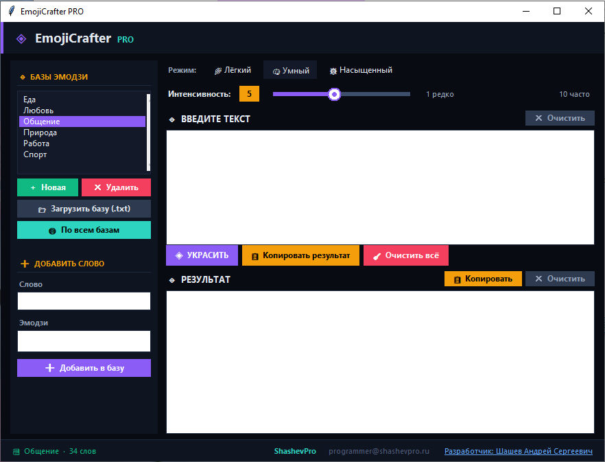

# EmojiCrafter PRO

### Умный декоратор текста с эмодзи · Smart emoji text decorator


---

Программа анализирует текст и автоматически расставляет эмодзи — по теме, настроению и структуре предложений. Не случайная вставка, а умный подбор по словарным базам.

Automatically decorates text with emoji based on topic, mood and sentence structure — not random insertion, but smart keyword matching.

---

## 🖥 Screenshot



---

## ✨ Возможности · Features

- **3 режима** — Лёгкий, Умный, Насыщенный
- **Слайдер интенсивности** — от 1 (редко) до 10 (часто)
- **6 встроенных баз** — Общение, Работа, Еда, Любовь, Природа, Спорт
- **Загрузка своих баз** из `.txt` файла
- **Создание и редактирование** собственных наборов эмодзи
- **Объединение баз** — работа по всем базам сразу
- **Автоопределение языка** — русский, английский и другие
- **Копирование результата** в буфер обмена одной кнопкой
- Работает офлайн, без интернета

---

## 📁 Структура · Structure

```
├── EmojiCrafter.py      # Main application
└── emoji_bases/         # Emoji keyword bases (JSON)
    ├── Общение.json
    ├── Работа.json
    ├── Еда.json
    ├── Любовь.json
    ├── Природа.json
    └── Спорт.json
```

---

## 🚀 Запуск · Run

```bash
pip install tk
python EmojiCrafter.py
```

Requires Python 3.8+. tkinter is included in standard Python distributions.

---

## 📦 Формат базы · Base format

JSON-файл с парами слово → эмодзи:

```json
{
  "привет": "👋",
  "спасибо": "🙏",
  "круто": "🔥"
}
```

Создай свой файл в том же формате и загрузи через кнопку **Загрузить базу (.txt)** — программа принимает как `.json` так и `.txt`.

---

## 📦 Build EXE (Windows)

```bash
pip install pyinstaller
pyinstaller --onefile --noconsole EmojiCrafter.py
```

Ready `.exe` is available in [Releases](../../releases).

---

## 🌐 Author

**Andrey Shashev · ShashevPro**

- 🌐 [shashevpro.ru](https://www.shashevpro.ru)
- 🛒 [kwork.ru/user/andreysha256](https://kwork.ru/user/andreysha256)
- 💬 [vk.com/andrey_shashev](https://vk.com/andrey_shashev)
- ✉️ programmer@shashevpro.ru

---

*MIT License · © ShashevPro*
